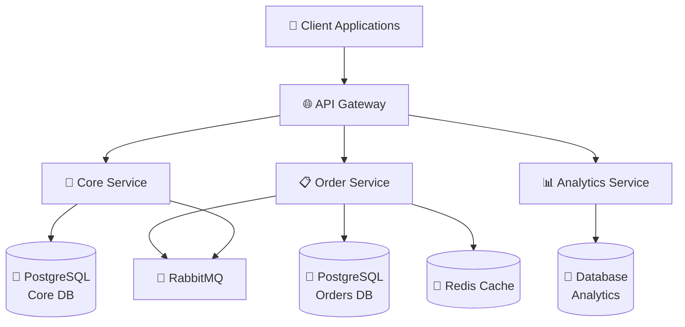

# Quick-Bite

A scalable, multi-region food ordering and delivery platform connecting customers, restaurants, delivery agents, and admins, with strong consistency for money and orders, and clear operational ownership.

## 📄 Table of Contents

- [🚀 Tech Stack](#-tech-stack)
- [✨ Features](#-features)
- [🏗️ Architecture Overview](#️-architecture-overview)
- [🗄️ Database Schema](#️-database-schema)
- [🔗 REST API Endpoints](#-rest-api-endpoints)
- [🛠️ Setup Instructions](#️-setup-instructions)
- [📖 API Usage Examples](#-api-usage-examples)
- [📁 Project Structure](#-project-structure)

## 🚀 Tech Stack

### 🏗️ Architecture & Framework
- **Backend Frameworks**: Node.js / TypeScript (Core & Order), Go (Analytics)
- **Microservices Communication**: Event-driven architecture, WebSockets (Socket.io) for real-time tracking
- **Architecture**: Multi-region, Microservices, Regional Database Sharding

### 🗄️ Databases
- **Relational Databases**: PostgreSQL (Core and Order services require relational DB)
- **NoSQL Databases**: MongoDB (Analytics service)
- **Caching & Idempotency**: Redis
- **Message Broker**: RabbitMQ

### 🚀 DevOps & Deployment
- **Scaling**: Horizontal Scaling, Load Balancing, Read Replicas
- **Deployment**: Multi Availability Zone Deployment

### 🛠️ Development Tools
- **Testing**: Jest / Supertest
- **Database Migrations**: Knex

## ✨ Features

### 🏢 Core Services
- **Core Platform (Core-Service)**: Manages users (Customers, Restaurant Employees, Delivery Agents), roles, and restaurant menus. Built with Node.js/Express. Optimized for read-heavy operations.
- **Order Service (Order-Service)**: Handles order placement, tracking, Kashier payments, transactional outbox events, and delivery assignments. Built with Node.js/Express and uses regional database sharding. Optimized for write-heavy operations with strong consistency.
- **Analytics Service (Analytics-Service)**: High-performance Go microservice maintaining day-grained operational aggregates in MongoDB. Handles join-heavy operations and business analytics.

### 🎯 Key Features
- **High Write Orders & Sharding**: Multi-region database sharding (e.g., `eg`, `ksa`) and automated archival (pg_partman) optimized for high write throughput.
- **Strong Consistency**: Guaranteed consistency for payments (Kashier webhook integration) and orders via transactional outbox.
- **Real-time Order Tracking**: Socket.io connections for real-time order status updates to customers.
- **Delivery by Proximity**: Delivery agents assigned based on location proximity using Redis `SET NX EX` offer/claim pattern.
- **Idempotency**: Robust idempotency for payments and transactions.
- **RBAC**: Role-based access control for restaurant staff and admins.

## 🏗️ Architecture Overview



## 🗄️ Database Schema

### 🐘 CoreService (PostgreSQL)
```sql
-- Users Table
CREATE TABLE users (
    id SERIAL PRIMARY KEY,
    email TEXT NOT NULL UNIQUE,
    phone TEXT NOT NULL UNIQUE,
    name TEXT NOT NULL,
    password_hash TEXT NOT NULL,
    system_role TEXT NOT NULL CHECK (system_role IN ('system_admin', 'customer', 'restaurant_user', 'delivery_agent')),
    created_at TIMESTAMP NOT NULL,
    updated_at TIMESTAMP NOT NULL,
    deleted_at TIMESTAMP
);

-- Restaurants Table
CREATE TABLE restaurants (
    id BIGSERIAL PRIMARY KEY,
    owner_id BIGINT NOT NULL REFERENCES users(id),
    name TEXT NOT NULL,
    status TEXT NOT NULL CHECK (status IN ('active', 'suspended', 'disabled', 'pending')) DEFAULT 'active',
    created_at TIMESTAMP NOT NULL,
    logo_url TEXT NOT NULL,
    primary_country TEXT NOT NULL,
    updated_at TIMESTAMP NOT NULL,
    status_updated_at TIMESTAMP NOT NULL
);
```

### 🐘 OrderService (PostgreSQL)
```sql
-- Orders table
CREATE TABLE orders (
    id BIGINT NOT NULL DEFAULT nextval('orders_id_seq'::regclass),
    region TEXT NOT NULL,
    public_id UUID NOT NULL,
    country_code TEXT NOT NULL,
    restaurant_id BIGINT NOT NULL,
    restaurant_owner_id BIGINT NOT NULL,
    branch_id BIGINT NOT NULL,
    customer_id BIGINT NOT NULL,
    customer_address_id BIGINT NOT NULL,
    delivery_lat DECIMAL(10,7) NOT NULL,
    delivery_lng DECIMAL(10,7) NOT NULL,
    delivery_address_text_snapshot TEXT NOT NULL,
    branch_lat DECIMAL(10,7) NOT NULL,
    branch_lng DECIMAL(10,7) NOT NULL,
    status TEXT NOT NULL,
    subtotal INT NOT NULL,
    delivery_fee INT NOT NULL,
    service_fee INT NOT NULL,
    total INT NOT NULL,
    commission INT NOT NULL DEFAULT 0,
    currency TEXT NOT NULL,
    payment_method TEXT NOT NULL CHECK (payment_method IN ('online','cod')),
    delivery_agent_id BIGINT,
    created_at TIMESTAMP NOT NULL DEFAULT NOW(),
    updated_at TIMESTAMP NOT NULL DEFAULT NOW(),
    accepted_at TIMESTAMP NULL,
    rejected_at TIMESTAMP NULL,
    ready_at TIMESTAMP NULL,
    assigned_at TIMESTAMP NULL,
    picked_at TIMESTAMP NULL,
    delivered_at TIMESTAMP NULL,
    cancelled_at TIMESTAMP NULL,
    PRIMARY KEY (id, created_at)
) PARTITION BY RANGE (created_at);

-- Order Items table
CREATE TABLE order_items (
    id BIGSERIAL PRIMARY KEY,
    region TEXT NOT NULL,
    order_id BIGINT NOT NULL,
    product_id BIGINT NOT NULL,
    quantity INT NOT NULL CHECK (quantity > 0),
    unit_price_snapshot INT NOT NULL,
    name_snapshot TEXT NOT NULL,
    image_url_snapshot TEXT NULL,
    line_total INT NOT NULL,
    created_at TIMESTAMP NOT NULL DEFAULT NOW()
);
```

### 🍃 AnalyticsService (MongoDB)
```javascript
// Day-grained operational aggregates collection
{
  date: "2026-09-10",
  restaurantId: 42,
  ordersCount: 1,
  revenueMinor: 2500,
  currency: "EGP",
  avgOrderMinor: 2500
}
```

## 🔗 REST API Endpoints

### 🏢 Core-Service
```
GET    /restaurants               # List restaurants
GET    /restaurants/{id}/menu     # List menu items
POST   /users                     # Create user/customer
```

### 📋 Order-Service
```
POST   /orders                    # Create a new order
GET    /orders/{id}               # Get order details
PATCH  /orders/{id}/status        # Update order status
```

## 🛠️ Setup Instructions

### 📋 Prerequisites
- Node.js & npm (v20+)
- PostgreSQL 16 (with PostGIS extensions)
- Redis
- RabbitMQ
- Docker & Docker Compose (Recommended)
- Go 1.21 (for Analytics-Service)

### Option A: Running with Docker Compose (Zero Host Dependencies)
This approach provides a completely self-contained setup. It automatically spins up the required infrastructure, runs database migrations across all databases (including multi-region initialization like `order_service_eg`), and starts both the APIs and their background workers.

1. **Clone and Configure**
   ```bash
   git clone <repository-url>
   cd Quick-Bite
   cp Core-Service/.env.example Core-Service/.env
   cp Order-Service/.env.example Order-Service/.env
   ```

2. **Start the Core Service**
   ```bash
   cd Core-Service
   docker compose up -d
   ```

3. **Start the Order Service**
   ```bash
   cd ../Order-Service
   docker compose up -d
   ```

### Option B: Local Node.js / Go Development (Host Mode)

1. **Start Infrastructure Containers**
   ```bash
   docker compose up -d postgres redis rabbitmq
   ```

2. **Setup Core-Service**
   ```bash
   cd Core-Service
   npm install
   npm run migrate
   # Start API server and Background Worker
   npm run dev & npm run worker:dev
   ```

3. **Setup Order-Service**
   ```bash
   cd ../Order-Service
   npm install
   # Run multi-region database migrations
   npm run migrate:all
   # Start API server and Background Worker
   npm run dev & npm run worker
   ```

4. **Setup Analytics-Service**
   ```bash
   cd ../Analytics-Service
   # Start MongoDB client, RabbitMQ consumer, and API server
   go run ./cmd/api
   ```

## 📖 API Usage Examples

### Placing an Order
```bash
# Create an order
curl -X POST http://localhost:4000/orders \
  -H "Content-Type: application/json" \
  -H "Authorization: Bearer YOUR_JWT_TOKEN" \
  -d '{
    "branchId": 12,
    "customerAddressId": 45,
    "paymentMethod": "online",
    "items": [
      {
        "productId": 101,
        "quantity": 2
      },
      {
        "productId": 105,
        "quantity": 1
      }
    ]
  }'
```

### Updating Order Status
```bash
# Update order status
curl -X PATCH http://localhost:4000/orders/123/status \
  -H "Content-Type: application/json" \
  -H "Authorization: Bearer YOUR_JWT_TOKEN" \
  -d '{
    "status": "preparing",
    "reason": "Kitchen has started preparing the meal"
  }'
```

### Updating User Profile
```bash
# Update user profile information
curl -X PATCH http://localhost:3000/users/profile \
  -H "Content-Type: application/json" \
  -H "Authorization: Bearer YOUR_JWT_TOKEN" \
  -d '{
    "name": "John Doe",
    "phone": "0123456789"
  }'
```

## 📁 Project Structure

```
Quick-Bite/
├── Core-Service/                 # User, Restaurant, and Menu Management
│   ├── src/
│   │   ├── app/                  # Domain modules (auth, branch, product, rbac, restaurant, user)
│   │   ├── lib/                  # Shared core logic (express, knex, pagination, rbac decorators)
│   │   └── migrations/           # PostgreSQL schema definitions
│   └── scripts/                  # DB and infra scripts
├── Order-Service/                # Order Processing, Payments, WebSockets
│   ├── src/
│   │   ├── app/                  # Domain modules (agent, assignment, finance, order, payment)
│   │   ├── lib/                  # Multi-region sharding logic, WebSocket handling, redis locks
│   │   ├── pkg/                  # Kashier payments, rabbitMQ messaging integration
│   │   └── migrations/           # Multi-region partition schemas
│   └── tests/                    # Unit and integration tests
├── Analytics-Service/            # Business Analytics and Reporting
│   ├── cmd/api/                  # Go entrypoint for API endpoints
│   └── play/                     # Tools and mock core scripts
├── loadtest/                     # Load testing scripts
├── Product Requirement Document/ # PRDs and documentation
└── README.md
```
